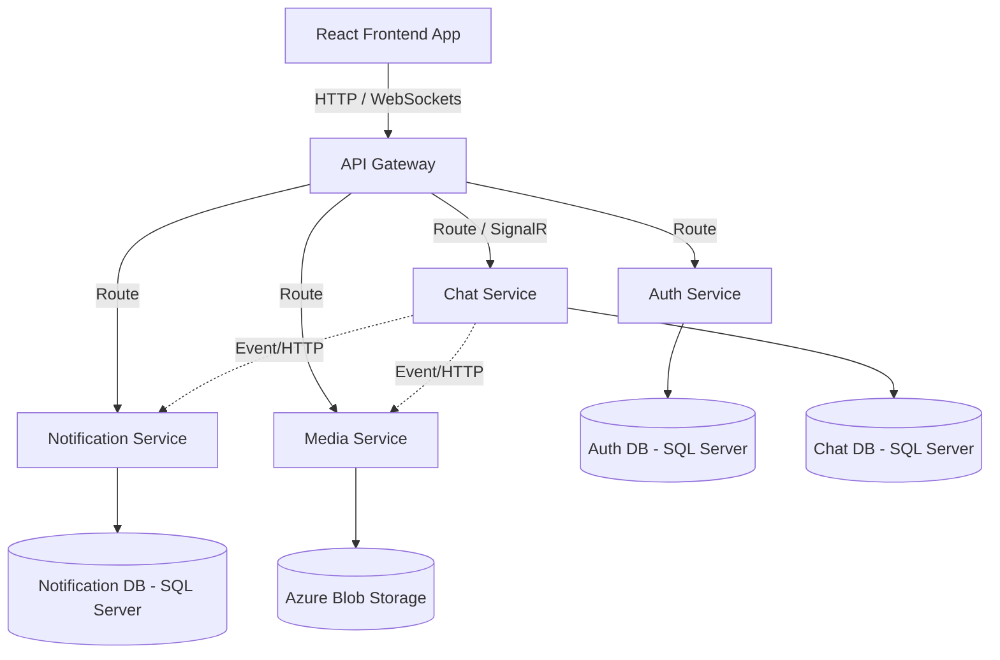

# ConnectHub: System Design Document

This document outlines the High-Level Design (HLD) and Low-Level Design (LLD) for the **ConnectHub Chat Application**, a modern, real-time messaging platform built using a microservices architecture.

---

## 1. High-Level Design (HLD)

The High-Level Design provides a birds-eye view of the system's architecture, components, and how they interact. 

### 1.1. System Architecture Pattern
ConnectHub uses a **Microservices Architecture**. The system is decomposed into loosely coupled, highly cohesive, independently deployable backend services. The services communicate with the frontend via an API Gateway and rely on asynchronous message passing and real-time WebSockets (SignalR) where necessary.

### 1.2. Core Components
- **Frontend (Client Application):** 
  - A responsive web application built with **React** (utilizing Context API for state management).
  - Handles UI rendering, user interactions, routing, and real-time DOM updates.
- **API Gateway:** 
  - Acts as the single entry point for the frontend, routing requests to appropriate backend microservices.
  - Implements cross-cutting concerns like reverse routing and potentially rate limiting.
- **Microservices (Backend):** Built with **ASP.NET Core 8 Web API**.
  - **AuthService:** Manages user registration, authentication (JWT), identity verification, and OAuth (Google).
  - **ChatService:** Core business logic for handling conversations, 1-to-1 messaging, group chats, message persistence, and real-time delivery via **SignalR**.
  - **MediaService:** Responsible for handling file uploads (images, videos, documents), generating thumbnails, and serving media. Integrates with **Azure Blob Storage**.
  - **NotificationService:** Handles delivering push notifications, offline messages logic, and system alerts.
- **Databases:** 
  - Each microservice owns its database to ensure decoupling (Database-per-service pattern).
  - Implemented using **SQL Server** via **Entity Framework Core**. (e.g., AuthDB, ChatDB, NotificationDb).
- **Storage:** 
  - **Azure Blob Storage** for persisting user-uploaded media and avatars.
- **Infrastructure & Deployment:**
  - Containerized using **Docker**.
  - Orchestrated locally via **Docker Compose**.
  - Configured with environment variables and `.env` files for seamless CI/CD to cloud platforms.

### 1.3. Architecture Diagram (Mermaid)

### 1.4. Key Flows
- **Authentication:** User logs in via React App -> Request to API Gateway -> Routed to AuthService -> AuthService validates credentials against AuthDB -> Returns JWT -> Client stores JWT and uses it for subsequent requests.
- **Real-Time Messaging:** Client establishes SignalR WebSocket connection with ChatService -> User sends a message -> ChatService persists it to ChatDB -> ChatService broadcasts the message to the recipient's active SignalR connection -> Recipient's UI updates instantly.
- **Media Upload:** Client sends file to MediaService -> MediaService streams file to Azure Blob Storage -> Returns Media URI/Metadata -> Client attaches metadata to a Chat message -> Sends to ChatService.

---

## 2. Low-Level Design (LLD)

The Low-Level Design focuses on the internal structure of individual components, specific technologies, design patterns, and code-level architecture.

### 2.1. Microservice Architecture (Clean Architecture Pattern)
Each microservice (e.g., ChatService, MediaService, AuthService) is structured using **Clean Architecture** (or Onion Architecture) principles. This ensures that the core business logic (Domain) is independent of frameworks, UI, and external agencies.

The standard folder structure for a service (e.g., `ConnectHub.Media`):
1. **API Layer (`ConnectHub.Media.API`):** Contains Controllers, SignalR Hubs, Middleware, Dependency Injection setup, and `Program.cs`. Acts as the presentation mechanism.
2. **Application Layer (`ConnectHub.Media.Application`):** Contains Use Cases, DTOs (Data Transfer Objects), Interfaces, and Application Services. Orchestrates business workflows.
3. **Domain Layer (`ConnectHub.Media.Domain`):** Contains Enterprise Logic, Entities, Value Objects, and Domain Exceptions. Pure C# with no external dependencies.
4. **Infrastructure Layer (`ConnectHub.Media.Infrastructure`):** Implementation of interfaces defined in Application/Domain layers. Contains Entity Framework Core `DbContext`, Repositories, Database Migrations, and Azure Blob Storage clients.

### 2.2. Database Design & ORM
- **Entity Framework Core (Code-First):** Used for all data access. Migrations are managed locally and applied on application startup (or via CI/CD pipelines).
- **Data Models (Examples):**
  - *User Entity (Auth):* `Id`, `Email`, `PasswordHash`, `Name`, `ProfilePictureUrl`, `CreatedAt`.
  - *Message Entity (Chat):* `Id`, `SenderId`, `ReceiverId`, `Content`, `Timestamp`, `Status` (Sent/Delivered/Read), `MediaUrl`.
  - *Conversation Entity (Chat):* `Id`, `User1Id`, `User2Id`, `LastMessageId`, `UpdatedAt`.

### 2.3. Design Patterns Utilized
- **Repository Pattern:** Used in the Infrastructure layer to abstract database interactions and facilitate unit testing.
- **Dependency Injection (DI):** Heavily utilized throughout the ASP.NET Core stack to inject services, repositories, and configurations.
- **DTO (Data Transfer Object) Pattern:** Used to pass data between the API layer and Application layer, preventing Domain entities from being exposed to the client.
- **Factory Pattern:** Used for creating complex objects, like `DbContextFactory` for design-time migrations.
- **Observer Pattern (via SignalR):** For real-time event broadcasting to connected web clients.

### 2.4. Real-Time Communication Details
- **Technology:** ASP.NET Core SignalR.
- **Hub (`ChatHub.cs`):** Manages connections, disconnections, and mapping connection IDs to specific User IDs.
- **Features:** 
  - Emitting "Typing..." indicators.
  - Broadcasting new messages.
  - Emitting read receipts ("Seen" blue ticks).
  - Handling online/offline presence status.

### 2.5. Security Considerations
- **JWT (JSON Web Tokens):** Used for stateless authentication. Passed in the `Authorization: Bearer <token>` header.
- **CORS (Cross-Origin Resource Sharing):** Configured in API gateways/services to only allow the React frontend domain.
- **Environment Variables & `.env`:** Secrets (DB connection strings, Azure Storage keys, JWT secrets) are explicitly excluded from version control and injected via `.env` files/Docker environments.
- **Input Validation:** Enforced in the Application/API layer to prevent SQL injection and XSS.

### 2.6. Testing Strategy
- **Unit Testing:** Implemented using **MSTest**. Targets the Application and Domain layers (business logic) by mocking Infrastructure components (like Repositories using Moq or in-memory DBs).
- **Smoke/Integration Testing:** Validates that controllers map correctly and services successfully wire up DI containers.

### 2.7. Frontend (React) Internals
- **Component Structure:** Function components using React Hooks (`useState`, `useEffect`, `useCallback`).
- **State Management:** `ChatContext.jsx` manages the global state of active conversations, unread counts, and the SignalR connection instance.
- **Network calls:** `axios` instances configured with interceptors to automatically append JWT tokens to outgoing requests.
