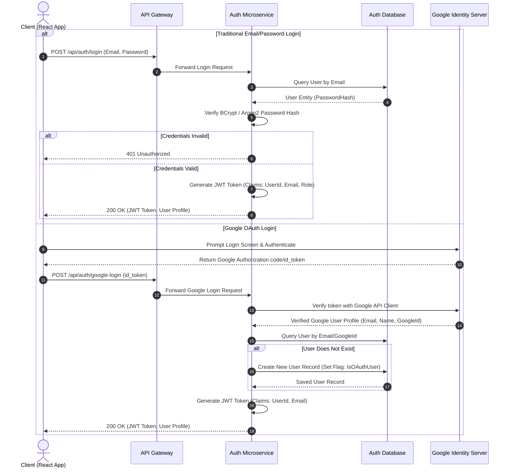
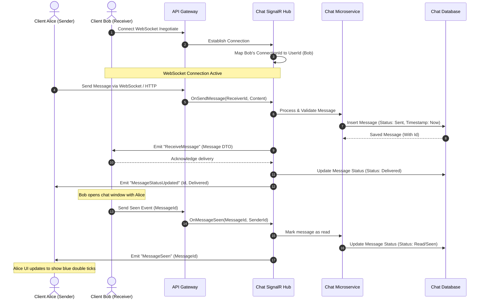
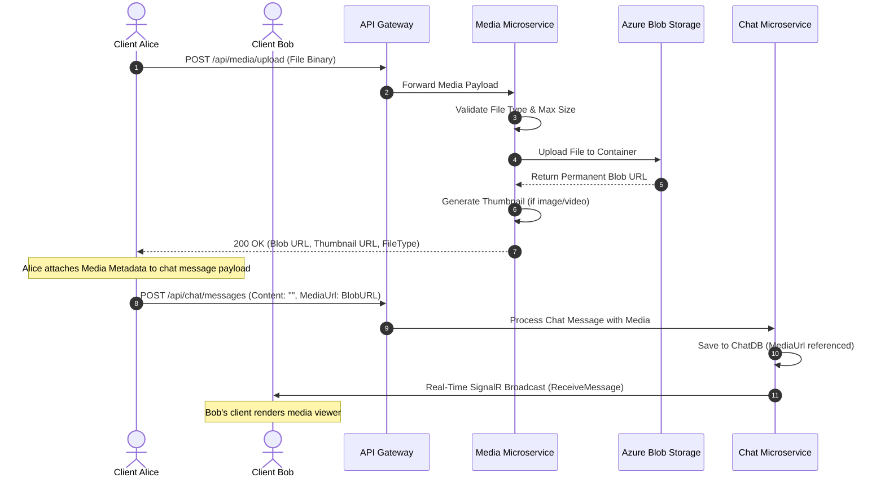
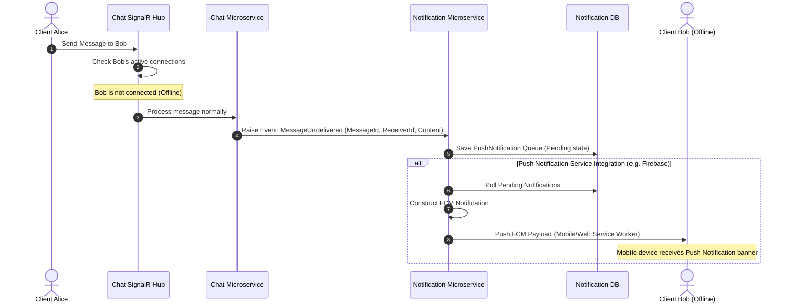
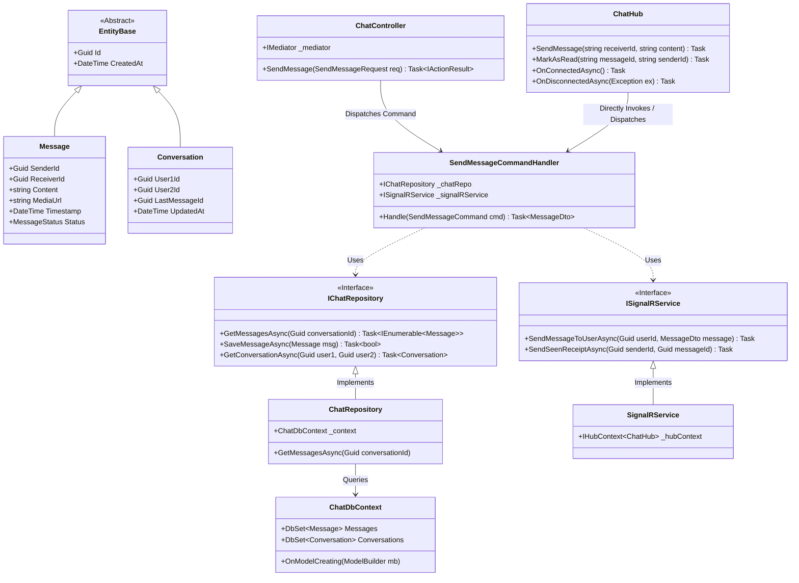

# ConnectHub: System Design Document

This document outlines the **High-Level Design (HLD)** and **Low-Level Design (LLD)** for the **ConnectHub Chat Application**, a production-grade, real-time messaging microservices system. It includes architecture diagrams, detailed feature flowcharts, database ER diagrams, and UML class diagrams.

---

# 1. High-Level Design (HLD)

The High-Level Design defines the system structure, responsibilities of each component, and the real-time communication patterns.

```
+-------------------------------------------------------------------+
|                          React Frontend                           |
+-------------------------------------------------------------------+
                                  | HTTP / WebSockets
                                  v
+-------------------------------------------------------------------+
|                        Ocelot API Gateway                         |
+-------------------------------------------------------------------+
         |                     |                     |
         +-------------+       +-------------+       +-------------+
         | (Auth API)  |       | (Chat API)  |       | (Media API) |
         v             v             v             v             v
   +-----------+ +-----------+ +-----------+ +-----------+ +-----------+
   |  Auth     | |  Chat     | |  Media    | | Notification| | Gateway   |
   |  Service  | |  Service  | |  Service  | |  Service    | |  Service  |
   +-----------+ +-----------+ +-----------+ +-----------+ +-----------+
         |             |             |             |
         v             v             v             v
    [(Auth DB)]   [(Chat DB)]  [Azure Blob]   [(Notify DB)]
```

---

## 1.1. Core Architectural Feature Flowcharts

### A. Authentication & OAuth Flow Chart
This flowchart describes the path for both Traditional (Email/Password) Login/Register and Google OAuth.



---

### B. Real-Time Chat & Seen Receipt Flow Chart
This sequence diagram shows how clients establish a WebSocket connection and how a chat message and read receipt ("Seen" ticks) are processed in real-time.



---

### C. Media Sharing & Persistent Upload Flow Chart
This flow details how rich media (images, files, PDFs) are shared and distributed securely.



---

### D. Offline Notifications System Flow Chart
This flow describes the actions taken when the receiver is offline and requires standard notifications.



---

# 2. Low-Level Design (LLD)

The Low-Level Design defines the implementation details, class layouts, schemas, and structural constraints.

## 2.1. Structural UML Class Diagram (Clean Architecture Layering)
ConnectHub implements a modular **Clean Architecture**. This UML diagram illustrates the logical separation and relationship between layers in our services (e.g., the Chat microservice).



---

## 2.2. Database Entity-Relationship (ER) Diagram
Below is the ER Diagram mapping the primary relational databases. Since we leverage a Microservices pattern, the schemas reside across independent databases (`AuthDB` and `ChatDB`) but are related logically via global `UserId` keys.

```mermaid
erDiagram
    %% AuthDB Schema %%
    USERS ||--o{ USER_ROLES : has
    USERS {
        Guid Id PK
        string Email UK
        string PasswordHash
        string DisplayName
        string ProfilePictureUrl
        string GoogleId NULL
        DateTime CreatedAt
    }
    USER_ROLES {
        Guid UserId FK
        string RoleName
    }

    %% ChatDB Schema %%
    CONVERSATIONS ||--o{ MESSAGES : contains
    CONVERSATIONS {
        Guid Id PK
        Guid User1Id
        Guid User2Id
        Guid LastMessageId FK
        DateTime UpdatedAt
    }
    MESSAGES {
        Guid Id PK
        Guid ConversationId FK
        Guid SenderId
        Guid ReceiverId
        string Content
        string MediaUrl NULL
        DateTime Timestamp
        string Status "Sent | Delivered | Read"
    }

    %% NotificationDB Schema %%
    NOTIFICATIONS {
        Guid Id PK
        Guid RecipientId
        string Title
        string Body
        bool IsRead
        DateTime CreatedAt
    }
```

---

## 2.3. Design Patterns Applied

### 1. CQRS (Command Query Responsibility Segregation)
By segregating write operations (Commands) from read operations (Queries), performance, scalability, and security are optimized.
- **Example Command:** `SendMessageCommand` -> Handled by changing DB state and publishing SignalR updates.
- **Example Query:** `GetChatHistoryQuery` -> Bypasses heavy business rules to pull directly from read-optimized DbContext mappings.

### 2. Dependency Injection & Repository Patterns
- All external calls (database queries, network requests, Azure operations) are isolated behind interfaces (`IChatRepository`, `IBlobStorageService`).
- ASP.NET DI handles standard service lifetimes (`Scoped` for repositories and contexts, `Singleton` for persistent helper utilities, `Transient` for transient request-level commands).

### 3. Gateway Routing & Reverse Proxy (Ocelot)
- ConnectHub Gateway exposes unified endpoints to the frontend, transforming external paths (e.g. `/api/v1/chat/messages`) internally to private addresses (e.g. `http://chat-api:8080/messages`) transparently.

---

## 2.4. Detailed Low-Level Component Responsibilities

| Service | Primary Component Class | Method Name | Functionality |
| :--- | :--- | :--- | :--- |
| **Auth** | `AuthService` | `GenerateJwtToken(User user)` | Builds token with `Claims` (Id, Role, Name) signed using HS256 algorithm and configured environment secret. |
| | `AuthService` | `RegisterUser(RegisterDto dto)` | Hashes raw password using BCrypt and saves user to Auth database. |
| **Chat** | `ChatHub` | `OnConnectedAsync()` | Reads authenticating JWT claim from query parameter, maps `Context.ConnectionId` to User ID using internal thread-safe memory storage. |
| | `ChatHub` | `SendMessage(string to, string msg)` | Broadcasts real-time events to dynamic Client connection IDs. |
| | `ChatRepository` | `GetConversationMessages(Guid convId)` | Returns historical messages sorted sequentially in chronological order. |
| **Media** | `BlobStorageService` | `UploadFileAsync(IFormFile file)` | Sanitizes file name, generates a unique GUID prefix, uploads stream directly to Azure Storage, and outputs a secure direct SAS URI. |
| **Notification** | `PushService` | `QueueNotification(Guid userId)` | Saves notification payloads to local DB to retry offline dispatches reliably. |
