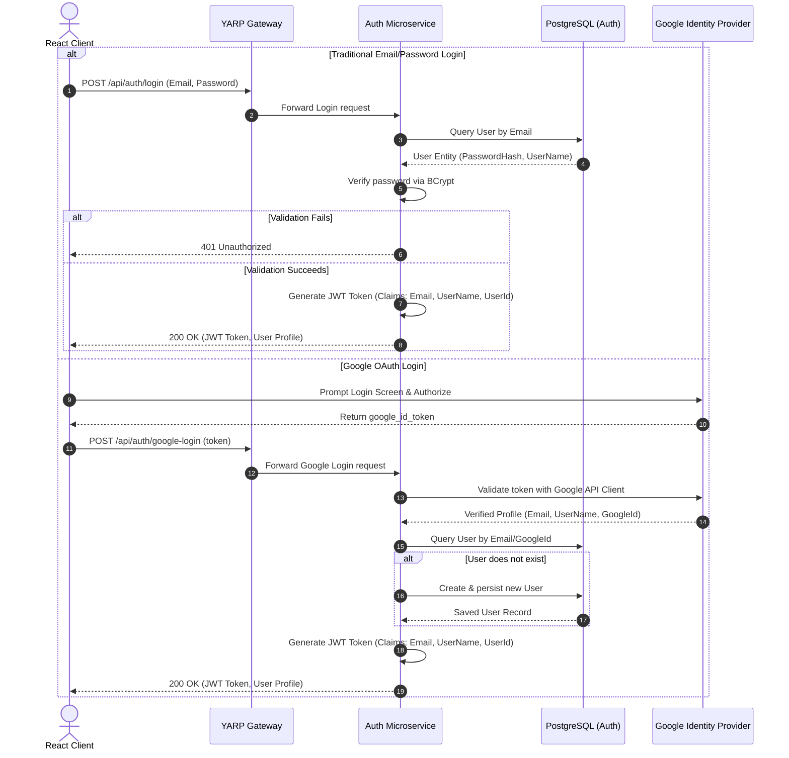
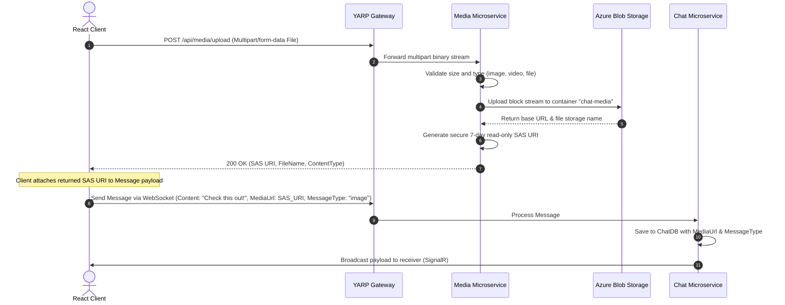
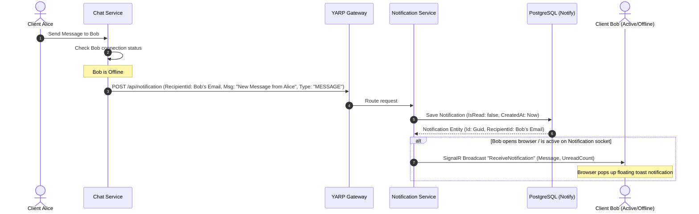
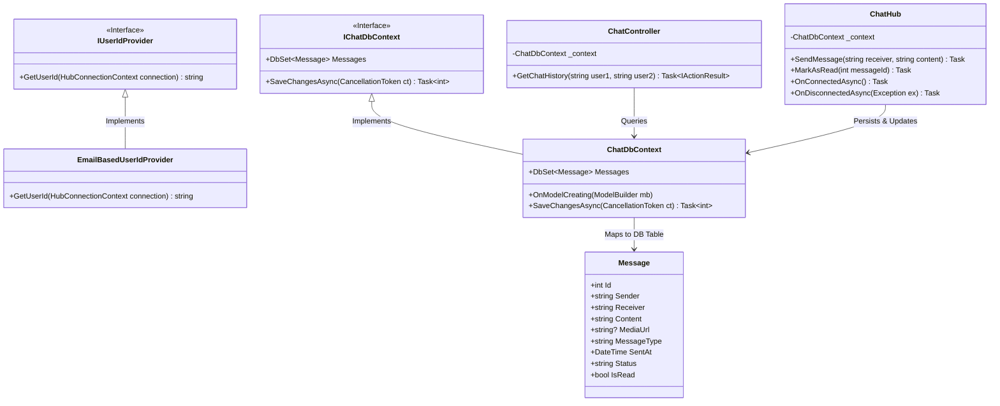
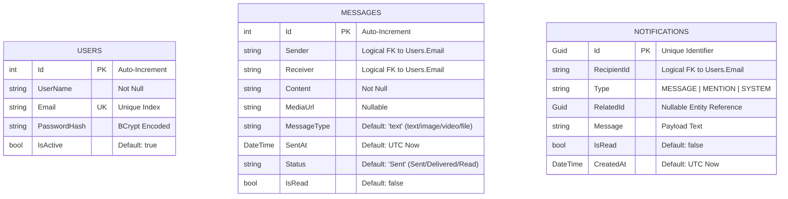

# ConnectHub: Architectural System Design Document (HLD & LLD)

This document provides a comprehensive, production-grade blueprint of the **ConnectHub Chat Application** architecture. It details both the **High-Level Design (HLD)** (covering system topology, routing, and end-to-end features) and the **Low-Level Design (LLD)** (defining Clean Architecture structure, PostgreSQL schemas, UML class interactions, custom SignalR identity mapping, and applied design patterns).

---

# 1. High-Level Design (HLD)

ConnectHub is built using a highly scalable, decoupled microservices architecture. It integrates real-time WebSockets communication, distributed persistence stores, secure cloud object storage, and unified reverse-proxy API routing.

## 1.1. System Topology & Network Architecture

The network flow routes all client requests through a centralized API Gateway powered by **YARP (Yet Another Reverse Proxy)**. The gateway handles Cross-Origin Resource Sharing (CORS) policies and routes traffic to isolated internal microservices running on dedicated private networks.

```
                                    +------------------------------+
                                    |        React Client          |
                                    |     (Vite Single Page App)   |
                                    +------------------------------+
                                          |             ^
                                     HTTP |             | WebSockets / SSE
                                     REST |             | (SignalR)
                                          v             |
                      +-------------------------------------------------------+
                      |                 YARP API Gateway                      |
                      |        [Port 7000] (Reverse Proxy & CORS)             |
                      +-------------------------------------------------------+
                            |                  |                 |
         /api/auth/*        |      /api/chat/* |  /api/media/*   |    /api/notification/*
       /generate-token      |       /chatHub   |                 |     /notificationHub
         +------------------+                  |                 +-------------------+
         |                                     |                                     |
         v                                     v                                     v
+------------------+                 +------------------+                 +---------------------+
|   Auth Service   |                 |   Chat Service   |                 |Notification Service |
|    [Port 5221]   |                 |    [Port 5262]   |                 |     [Port 5226]     |
+------------------+                 +------------------+                 +---------------------+
         |                                     |                                     |
         | EF Core                             | EF Core                             | EF Core
         v                                     v                                     v
+------------------+                 +------------------+                 +---------------------+
|  Neon Serverless |                 |  Neon Serverless |                 |   Neon Serverless   |
|   PostgreSQL     |                 |   PostgreSQL     |                 |     PostgreSQL      |
|  (Database: Auth)|                 |  (Database: Chat)|                 |  (Database: Notify) |
+------------------+                 +------------------+                 +---------------------+
                                               |
                                               | /api/media/upload
                                               v
                                     +------------------+
                                     |  Media Service   |
                                     |    [Port 5264]   |
                                     +------------------+
                                               |
                                               | Azure SDK
                                               v
                                     +------------------+
                                     |    Azure Blob    |
                                     |     Storage      |
                                     |  (chat-media)    |
                                     +------------------+
```

## 1.2. Microservices Directory & Responsibilities

| Service | Primary Stack | Purpose & Core Responsibility |
| :--- | :--- | :--- |
| **Api Gateway** | ASP.NET Core & YARP | Exposes a single entry point (Port 7000) for the React frontend; manages CORS, rewrites paths, and proxies REST/WebSocket requests. |
| [Auth Service](file:///c:/chat%20application/src/Service/AuthService) | C#, .NET 8, EF Core | Handles user registration, password hashing (BCrypt), credentials validation, Google OAuth flow, and JWT token issuance. |
| [Chat Service](file:///c:/chat%20application/src/Service/ChatService) | C#, .NET 8, SignalR, EF Core | Coordinates direct real-time message delivery, delivery/read statuses, active socket mappings, and chat history retrieval. |
| [Media Service](file:///c:/chat%20application/src/Service/MediaService) | C#, .NET 8, Azure Blob SDK | Receives media uploads, validates file type limits, persists binaries securely in Azure Blob Storage, and generates expiring SAS URIs. |
| [Notification Service](file:///c:/chat%20application/src/Service/NotificationService) | C#, .NET 8, SignalR, EF Core | Manages offline notifications, tracks unread counts, registers push-tokens, and dispatches real-time popups to active sessions. |

---

## 1.3. Core Architectural Feature Flowcharts

### A. Authentication & OAuth Flow
This sequence diagram details the two paths for authentication: Traditional Email/Password registration/login and Google OAuth ID-Token validation.



### B. Real-Time Chat & "Seen" Read-Receipt Flow
This sequence diagram details how clients establish WebSocket connections, transmit messages real-time, update delivery receipt, and handle "Seen" tick updates.

```mermaid
sequenceDiagram
    autonumber
    actor Alice as Client Alice (Sender)
    actor Bob as Client Bob (Receiver)
    participant Gateway as YARP Gateway
    participant ChatHub as Chat SignalR Hub
    participant ChatDB as PostgreSQL (Chat)

    %% WebSocket Connection Establishment %%
    Bob->>Gateway: Connect WebSockets (/chatHub?access_token=JWT)
    Gateway->>ChatHub: Establish Persistent WebSocket Pipe
    ChatHub->>ChatHub: Map connection via EmailBasedUserIdProvider
    Note over Bob, ChatHub: WebSocket Connection Active for Bob

    %% Message Exchange Flow %%
    Alice->>Gateway: Send Message (Receiver, Content) via WebSocket
    Gateway->>ChatHub: OnSendMessage(Receiver, Content)
    ChatHub->>ChatDB: Insert Message (Status: "Sent", IsRead: false, SentAt: Now)
    ChatDB-->>ChatHub: Returned Message Entity (Id: 1045)
    
    alt Bob is Online
        ChatHub->>Bob: Emit "ReceiveMessage" (Id: 1045, Content, Sender: Alice, Status: "Sent")
        Bob-->>ChatHub: Acknowledge client-side receipt
        ChatHub->>ChatDB: Update Message (Status = "Delivered")
        ChatHub->>Alice: Emit "MessageStatusUpdated" (Id: 1045, Status: "Delivered")
        Note over Alice: Alice UI shows double gray ticks
    end

    %% Seen Receipt Flow %%
    Note over Bob: Bob clicks chat window with Alice
    Bob->>Gateway: Send Seen Event (MessageId: 1045) via WebSockets
    Gateway->>ChatHub: MarkAsRead(MessageId: 1045)
    ChatHub->>ChatDB: Update Message (IsRead = true, Status = "Read")
    ChatHub->>Alice: Emit "MessageSeen" (Id: 1045)
    Note over Alice: Alice UI transitions to blue double ticks
```



### C. Rich Media sharing & Persistent Upload Flow
This diagram details the sequence for uploading files, documents, and pictures securely. The Media service isolates storage calls, returns secure expiring Shared Access Signature (SAS) tokens, and allows the Chat service to reference the file in the chat history.



### D. Real-Time & Push Notification Pipeline
This details how offline messages or direct system notifications are captured, cataloged, and broadcast to active browser sessions.



---

# 2. Low-Level Design (LLD)

The Low-Level Design details the clean architecture layout, database entity mappings, structural design patterns, and method signatures implemented across the microservices.

## 2.1. Structural UML Class Diagram (Clean Architecture)

ConnectHub uses **Clean Architecture** to ensure clean separation of concerns, decoupling code into Domain, Application, Infrastructure, and Presentation layers. This UML class diagram illustrates this architecture mapping using the Chat Service as an example:



---

## 2.2. Database Entity-Relationship (ER) Diagram

ConnectHub implements a shared-nothing distributed database architecture where each service manages its own isolated schema. The schemas are linked logically across databases using string-based email columns to avoid cross-database FK constraints.



### Database Performance Optimization & Indexing Strategy
To support real-time querying at scale, the following index configurations are applied across the PostgreSQL nodes:

1. **`Users` Database**:
   - `Unique Index` on `Users.Email`: Ensures rapid lookup of credentials during login and maps user IDs during queries.

2. **`Messages` Database**:
   - `Composite Index` on `(Sender, Receiver, SentAt)`: Optimizes chat history rendering, allowing standard pagination queries like:
     ```sql
     SELECT * FROM "Messages" 
     WHERE ("Sender" = $1 AND "Receiver" = $2) OR ("Sender" = $2 AND "Receiver" = $1)
     ORDER BY "SentAt" DESC LIMIT 50;
     ```
   - `Filtered Index` on `(Receiver)` WHERE `IsRead = false`: Boosts performance when rendering unread message badges upon user connection.

3. **`Notifications` Database**:
   - `Index` on `(RecipientId, IsRead)`: Speeds up retrieval of unread notifications during initial page load.

---

## 2.3. Low-Level Socket Identity Mapping & Custom User Providers

A key architectural detail is how ConnectHub routes SignalR messages. By default, SignalR resolves client connections based on numeric identifiers or name-claim mappings. In a decoupled environment, matching connection identifiers to specific users is complex. 

ConnectHub overcomes this by utilizing custom `IUserIdProvider` implementations to target active client connections directly by their authenticated **Email Address**:

### A. Chat API Connection Mapping
The [EmailBasedUserIdProvider](file:///c:/chat%20application/src/Service/ChatService/ConnectHub.Chat.API/Program.cs#L150-L156) maps active socket hubs based strictly on user emails:
```csharp
public class EmailBasedUserIdProvider : IUserIdProvider
{
    public string GetUserId(HubConnectionContext connection)
    {
        // Extracts the validated Email claim from the JWT token
        return connection.User?.FindFirst(ClaimTypes.Email)?.Value;
    }
}
```
This enables the Chat Hub to broadcast messages directly via email strings rather than querying internal databases:
```csharp
await Clients.User(receiverEmail).SendAsync("ReceiveMessage", messagePayload);
```

### B. Notification API Connection Mapping
The [CustomUserIdProvider](file:///c:/chat%20application/src/Service/NotificationService/ConnectHub.Notification.API/CustomUserIdProvider.cs) fallback chain ensures robustness. If the email claim is absent, it falls back to `"UserId"` or `NameIdentifier` claims:
```csharp
public class CustomUserIdProvider : IUserIdProvider
{
    public string? GetUserId(HubConnectionContext connection)
    {
        return connection.User?.FindFirst(ClaimTypes.Email)?.Value
            ?? connection.User?.FindFirst("UserId")?.Value
            ?? connection.User?.FindFirst(ClaimTypes.NameIdentifier)?.Value;
    }
}
```

---

## 2.4. Applied Software Design Patterns

| Pattern | Architectural Component | Low-Level Implementation & Rationale |
| :--- | :--- | :--- |
| **Gateway Routing / Reverse Proxy** | YARP Gateway | Decouples frontend requests from microservice locations. The Gateway proxies paths (e.g. `/api/chat/*` to private Service URLs) dynamically. |
| **Dependency Inversion** | Clean Architecture Layers | High-level application logic depends on abstractions (e.g., `IBlobStorageService`), which are implemented by lower-level infrastructure classes (`BlobStorageService`). |
| **Observer (Publish-Subscribe)** | SignalR Hubs | ConnectHub's core real-time capability. Senders publish events to ChatHub, which dynamically acts as a message broker to broadcast events to subscribed client channels. |
| **Strategy Pattern** | `IUserIdProvider` | Standardizes user session resolution. The runtime switches between custom socket mapping strategies (`EmailBasedUserIdProvider` vs. `CustomUserIdProvider`) seamlessly. |
| **Repository Pattern** | Entity Framework DbContext | Abstracts SQL operations. Entity models (`Message.cs`, `User.cs`) are treated as in-memory collections, separating core logic from SQL querying. |

---

## 2.5. Detailed Low-Level Component Responsibilities

This table maps the core classes and primary method signatures responsible for executing ConnectHub's business logic:

| Service Namespace | Class Name | Method Signature | Parameters | Return Type | Description / Low-Level Responsibility |
| :--- | :--- | :--- | :--- | :--- | :--- |
| **ConnectHub.Auth.API** | `AuthController` | `Login([FromBody] LoginRequest req)` | `LoginRequest` (Email, Password) | `Task<IActionResult>` | Authenticates traditional users. Queries EF Core for the email, compares BCrypt hashes, and returns a signed JWT. |
| **ConnectHub.Auth.API** | `AuthController` | `GoogleLogin([FromBody] TokenRequest req)` | `TokenRequest` (IdToken) | `Task<IActionResult>` | Decodes the Google OAuth ID-Token, maps verified claims, registers new users automatically, and issues a JWT. |
| **ConnectHub.Chat.API.Hubs** | `ChatHub` | `SendMessage(string receiver, string content)` | `string receiver`, `string content` | `Task` | Active WebSocket handler. Writes the message to PostgreSQL, triggers SignalR broadcasts, and updates the client delivery status. |
| **ConnectHub.Chat.API.Hubs** | `ChatHub` | `MarkAsRead(int messageId)` | `int messageId` | `Task` | Updates the status of a message to "Read" in the database and broadcasts the "MessageSeen" event to the sender. |
| **ConnectHub.Media.API.Services** | [BlobStorageService](file:///c:/chat%20application/src/Service/MediaService/ConnectHub.Media.API/Services/BlobStorageService.cs) | `UploadFileAsync(Stream file, string name, string type)` | `Stream fileStream`, `string fileName`, `string contentType` | `Task<string>` | Sanitizes the file name, prefixes a unique GUID, uploads the stream to Azure Blob Storage, and generates a secure 7-day SAS URI. |
| **ConnectHub.Notification.API** | `Program` | `app.MapPost("/notifications", ...)` | `INotificationService`, `IHubContext`, `Notification` | `Task<IResult>` | REST Endpoint invoked by other services. Persists notifications and pushes updates to active users via SignalR. |
